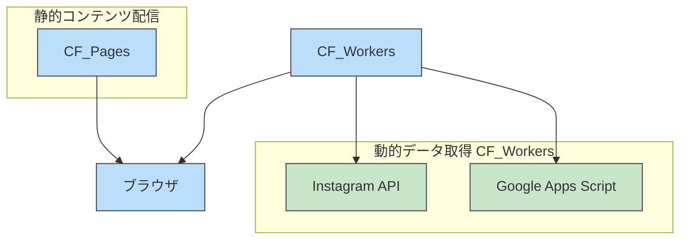

# totonari


## サービス概要
totonariは、審査によって選ばれた男女8人による2泊3日の共同生活を提供する共同生活型恋愛サービスです。効率や条件ではなく「人となり」で恋に気づく新しい出会いの場を創出し、恋愛リアリティショーのような非日常体験を提供します。
参加者は一緒にミッションに取り組み、食事を作り、コミュニケーションを通じて自分自身と向き合う時間を過ごします。
横浜エリアで毎月開催され、20代〜30代の様々な経歴を持つ方々が参加しています。
普段出会えない仲間との交流を通して、新たな自分の一面を発見し、自然な形で恋愛に前向きになれる環境を提供する、新しい形の出会いの場です。

## 技術スタック

- **フレームワーク**: [Next.js 15](https://nextjs.org/)
- **UI**: [React 19](https://react.dev/)
- **スタイリング**: [TailwindCSS 4](https://tailwindcss.com/)
- **アニメーション**: [Framer Motion](https://www.framer.com/motion/)
- **カルーセル**: [Embla Carousel](https://www.embla-carousel.com/)
- **デプロイ**: [Cloudflare Pages & Workers](https://pages.cloudflare.com/)

## プロジェクト構造

```
totonari-copy/
├── functions/       # Cloudflare Functions API
├── public/          # 静的アセット
├── shared/          # 共有タイプと定数
├── src/
│   ├── app/         # Next.js App Router
│   │   ├── (docs)/  # ドキュメントページ
│   │   └── (top)/   # メインページとコンポーネント
│   ├── components/  # 共通コンポーネント
│   └── styles/      # グローバルスタイル
└── workers/         # Cloudflare Workers
```

## インフラアーキテクチャ



このウェブサイトはCloudflare Pagesにデプロイされる静的サイトです。動的なコンテンツはCloudflare Workersを通じて処理されます：

1. **静的コンテンツ**: Next.jsでビルドされた静的ファイルはCloudflare Pagesによってグローバルに配信されます
2. **動的データ**: 
   - InstagramフィードはInstagram APIから取得
   - イベントスケジュールなどのデータはGoogle Apps Script (GAS) から取得

この構成により、高速な静的サイト配信と、最新データの動的な取得を両立しています。サーバーレスアーキテクチャを採用することで、メンテナンスコストを削減しつつ、スケーラビリティを確保しています。
